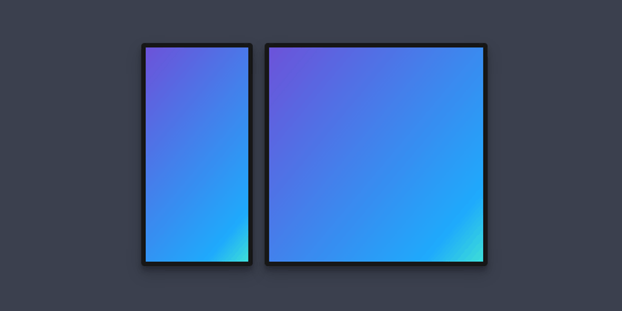

## Introduction

CSS Grid is a (relatively) new, powerful, and versatile tool for creating modern layouts. It also has 18 new properties and therefore has a steep learning curve. Or does it?

My reason for writing this article was to demonstrate that not only this is not true, but that you can learn all you need to know to scaffold great UI with Grid, in less than 5 minutes.

I should mention that the goal of this article is not to provide an exhaustive encyclopedic guide to CSS Grid. This is because there are already many resources available online (links at the end) that do this way better than I ever could. I'm hoping however, to help you get up and running with Grid and hopefully understand and appreciate what it can offer along the way.

Also, please note that it might be a good idea to use [Firefox Developer Edition](https://www.mozilla.org/en-US/firefox/developer/) when working with CSS Grid, mainly because it can help visualize you grid designs better than other browsers at the moment. This is however not a requirement by any means.

Let's get started.

## The Basics

As you might know, unlike Flex, CSS Grid works on a 2-dimensional system. With Flex, you specify whether you want your container's items to be arranged in a column or a row, and then you can modify properties that move them around that single axis. With Grid however, you are not restricted to just the column or the row and you able to arrange your items along either axis at the same time. 

Grid achieves this by allowing you to specify grid lines for a parent container and then letting you assign locations to its children by declaring the vertical and horizontal start and finish lines for them.

Sounds a bit complicated, doesn't it? Let's look at an example for the following design:



```css
#article {
  display: grid;
  grid-template-columns: 150px 1fr;
}

#sidebar {
  grid-column: 1 / 2;
}

#content {
  grid-column: 2 / 3;
}
```

Not too bad, right? But it can be much better. Let's say for the responsive phone view, you would like to stack `#sidebar` and `#content` on top of each other. One way to do it would be to write media queries for each element like so:

```css {3, 4, 8, 12}
@media (min-width: 320px) and (max-width: 480px) {
  #article {
    grid-template-columns: 1fr;
    grid-template-rows: auto auto;
  }

  #sidebar {
    grid-row: 1 / 2;
  }

  #content {
    grid-row: 2 / 3;
  }
}
```

This will certainly do the job but as you can see, with our current method we would have to modify multiple elements to create our desired effect on smaller screens. We are not taking advantage of one of Grid's most powerful features:

## Named Areas

Let's create the same layout, this time using `grid-template`:


```css
#article {
  display: grid;
  grid-template: 
    "sidebar main" auto / 150px 1fr;
}

#sidebar {
  grid-area: sidebar;
}

#content {
  grid-area: main;
}
```

Here, we have assigned names to the areas we had in mind, given them a row height of `auto` and given them the same widths as before, all in one property. This means that now, we don't need to bother with using line numbers to choose the children's locations. Therefore, in order to create the same responsive layout as before, we could just change `#article` in our media query:

```css {3-5}
@media (min-width: 320px) and (max-width: 480px) {
  #article {
    grid-template: 
      "sidebar" auto 
      "main   " auto / 1fr;
  }
}
```

As you can see, this makes it possible for you to visualize UI as you are writing CSS. This means in order to create any layout, you first need to plan it by drawing grid lines, and dividing it into areas that you can name later.

It's important to note that the areas you assign in the parent container need to create a complete rectangular shape, which means no **L-shaped** selections are allowed. If an area is not assigned to any element, you must put **dots** in its place. You can use as many dots as you want as long as they connect. Similarly, you can also use as many **spaces** you want in-between your elements if you need them to align correctly. Here's how that would look like:

```css
#card {
  grid-template:
    "meta   ....." auto
    "title  image" 80px
    "tags   ....." auto / 1fr 80px;
  }
}
```

## Conclusion

The key to creating great grid layouts is to first plan where each element goes in regards to the parent container. This can be achieved by drawing grid lines over your design and taking note of where each element goes. Then all that needs to be done is to use `grid-template` in the parent container to create the layout, and then for each child to be assigned to their respective area names using `grid-area`.

#### Links to Other Resources

* [A Complete Guide to Grid](https://css-tricks.com/snippets/css/complete-guide-grid/)
* [A guide to learning CSS grid by @jonsuh](https://learncssgrid.com/)
* [Grid Garden](https://cssgridgarden.com/)


